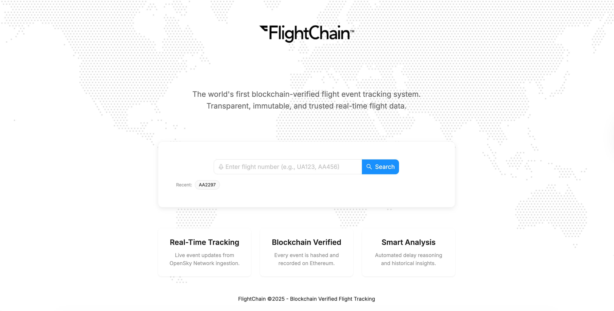
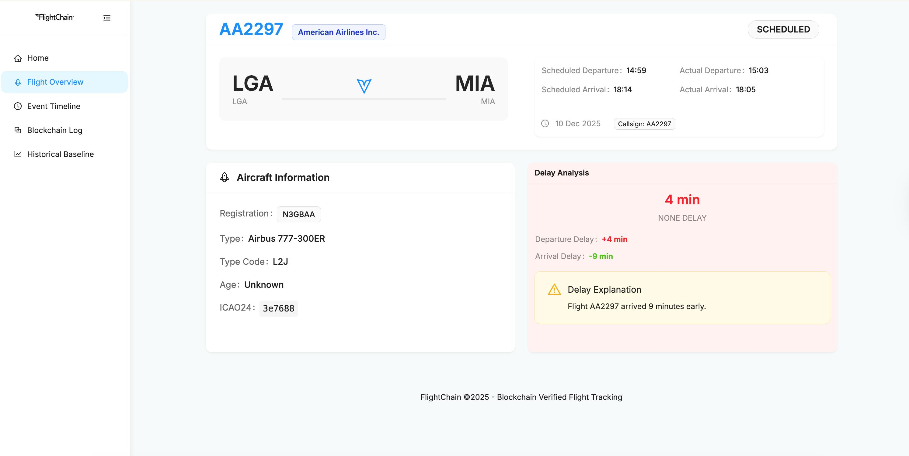
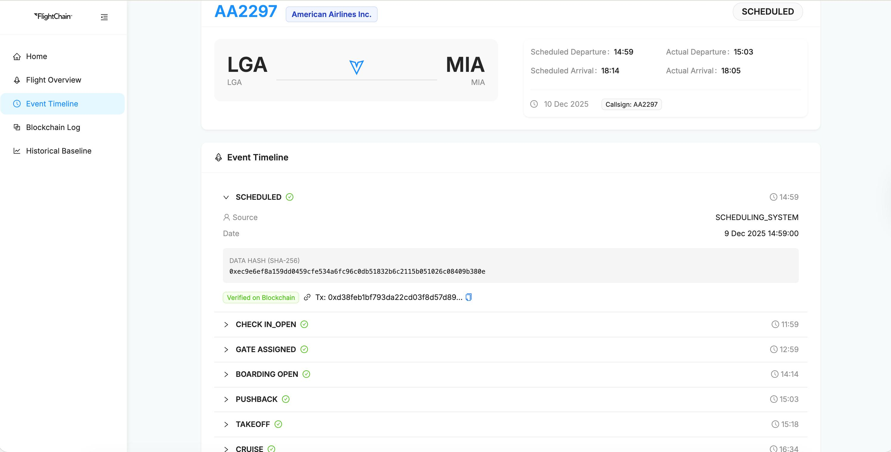
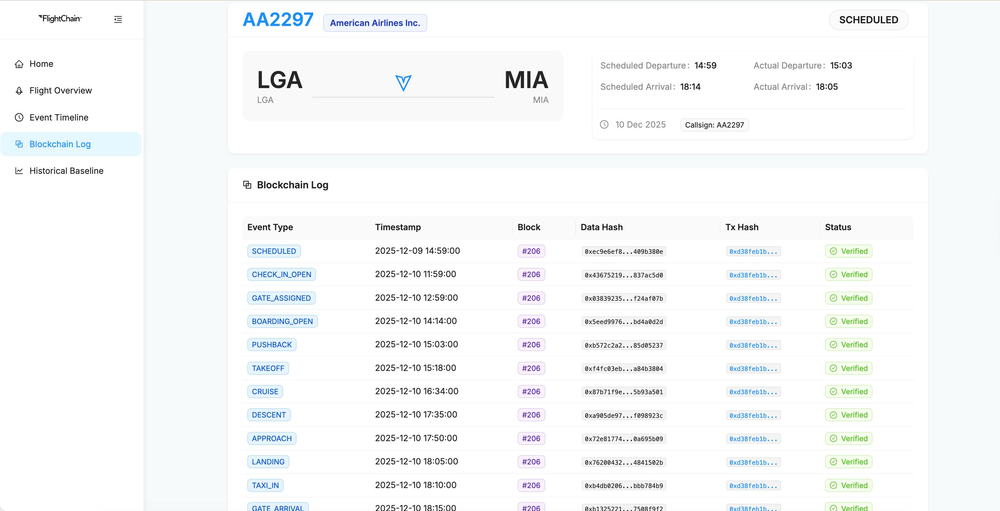
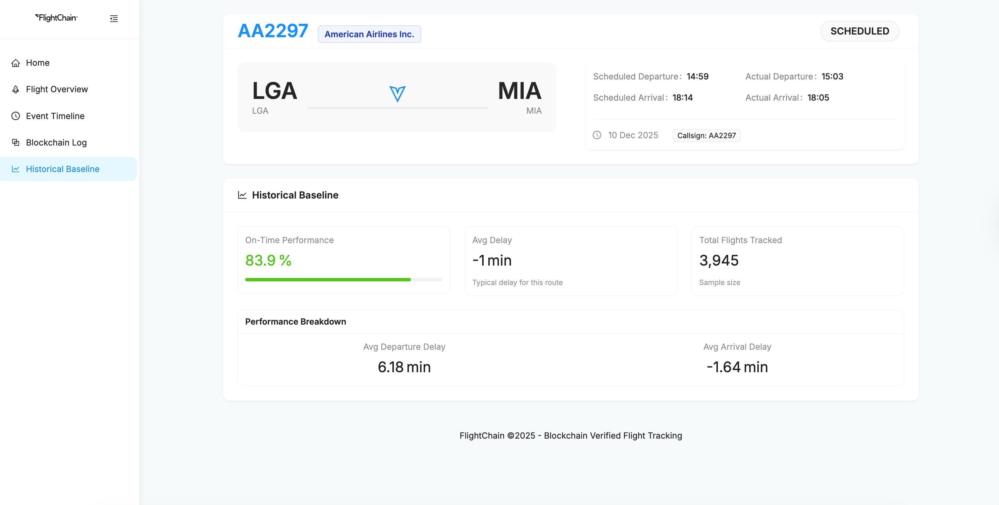

# FlightChain

**Blockchain-Verified Flight Event Tracking System**

## Team Members

- **Parth Gohil** - CWID: 871916672
- **Amit Mittal** - CWID: 812955029
- **GitHub Repo Link** - https://github.com/parth2103/FlightChain

## Project Overview

FlightChain is a full-stack web application that provides transparent, verifiable flight event data. It leverages Ethereum smart contracts to immutably record flight events, ensuring data integrity for passengers, insurers, and aviation stakeholders. The system integrates blockchain technology with flight tracking to create an immutable audit trail of flight events.

## Screenshots

### Landing Page
The clean, minimalist landing page with flight search functionality.



### Flight Overview
Detailed flight information including route, times, aircraft details, and delay analysis.



### Event Timeline
Chronological timeline of all flight events with blockchain verification status.



### Blockchain Log
Complete list of all flight events recorded on the blockchain with transaction hashes and block numbers.



### Historical Baseline
Route performance statistics showing on-time performance, average delays, and total flights tracked.



## What We Built

### Core Features

- **Flight Search**: Search for flights by flight number (e.g., UA123, AA456) using historical flight data from CSV database
- **Event Timeline**: Detailed timeline of flight events including Gate Open, Boarding, Takeoff, Landing, and Gate Arrival
- **Blockchain Verification**: Every flight event is hashed and stored on a local Ethereum blockchain (Ganache), with visual verification badges
- **MetaMask Integration**: Users interact directly with the blockchain via MetaMask, approving transactions and paying minimal gas fees
- **Delay Analysis**: Automated analysis of flight delays with categorized reasons (minor, moderate, significant, severe) and human-readable explanations
- **Historical Baseline**: Route performance comparison showing average delays, on-time percentage, and total flights tracked
- **Aircraft Metadata**: Detailed aircraft information including registration, manufacturer, model, and operator

### Technical Implementation

#### Frontend
- **Framework**: Next.js 14 with App Router
- **UI Library**: Ant Design (Antd) for components
- **Blockchain Integration**: Ethers.js v6 for MetaMask interactions
- **Styling**: Tailwind CSS with custom components
- **State Management**: React hooks and context
- **Real-time Updates**: Blockchain console showing transaction progress

#### Backend
- **Framework**: FastAPI with async/await support
- **Database**: MySQL with SQLAlchemy ORM
- **Blockchain Integration**: Web3.py for smart contract interactions
- **Data Source**: CSV file containing 336,777 historical flight records
- **API**: RESTful API with comprehensive error handling and CORS support

#### Blockchain
- **Network**: Local Ethereum blockchain using Ganache
- **Smart Contract**: Solidity contract for flight event registry
- **Development Tools**: Truffle framework for compilation and migration
- **Transaction Management**: Prepared transactions sent via MetaMask for user approval

#### Data Flow
1. User searches for a flight number on the landing page
2. System checks blockchain for existing events
3. If not found, flight data is retrieved from CSV database
4. Flight events are created in MySQL database
5. MetaMask modal prompts user to approve transactions
6. User approves transactions and pays gas fees
7. Events are recorded on blockchain with hash verification
8. Flight details are displayed with blockchain verification status

### Key Components

**Smart Contract**: `FlightEventRegistry.sol`
- Records flight events with unique hashes
- Prevents duplicate event recording
- Stores event metadata including flight ID, event type, timestamp, and actor

**Backend Services**:
- `CSVFlightService`: Parses and queries flight data from CSV file
- `FlightService`: Manages flight creation and data retrieval
- `BlockchainService`: Handles smart contract interactions
- `DelayAnalyzer`: Analyzes flight delays and generates explanations
- `EventAssembler`: Creates flight events from flight data

**Frontend Components**:
- `BlockchainConsole`: Real-time transaction logging interface
- `FlightSummary`: Displays key flight information
- `DelaySummary`: Shows delay analysis with color-coded status
- `EventTimeline`: Visual timeline of flight events
- `BlockchainLog`: List of blockchain-verified events
- `HistoricalBaseline`: Route performance statistics
- `WorldMap`: Animated background map component

## Architecture

- **Frontend**: Next.js 14, Ant Design, TypeScript, Tailwind CSS
- **Backend**: FastAPI, SQLAlchemy, Web3.py, Pydantic
- **Database**: MySQL 8.0+
- **Blockchain**: Truffle, Ganache (Local Ethereum), Solidity
- **Integration**: MetaMask, Ethers.js, Web3.py

## Prerequisites

- Node.js 18+
- Python 3.10+
- MySQL 8.0+
- Ganache (CLI or GUI)
- MetaMask browser extension
- Git

## Getting Started

### 1. Clone the Repository

```bash
git clone https://github.com/parth2103/FlightChain.git
cd FlightChain
```

### 2. Blockchain Setup

Start local blockchain and deploy contracts.

```bash
# Terminal 1 - Start Ganache
cd blockchain
npm install
npm run ganache  # Starts Ganache on port 7545
```

**Note**: Ganache GUI should be configured to run on port 7545. If using CLI, update the port in truffle-config.js.

```bash
# Terminal 2 - Deploy Contract
cd blockchain
truffle migrate --network development
# Copy the deployed Contract Address from the output!
```

### 3. Backend Setup

Configure and start the Python API.

```bash
# Terminal 3
cd backend

# Create virtual environment (optional but recommended)
python -m venv venv
source venv/bin/activate  # On Windows: venv\Scripts\activate

# Install dependencies
pip install -r requirements.txt

# Create .env file
cat > .env << EOF
DATABASE_URL=mysql+pymysql://root@localhost:3306/flightchain
GANACHE_URL=http://127.0.0.1:7545
CONTRACT_ADDRESS=YOUR_CONTRACT_ADDRESS_HERE
EOF

# Replace YOUR_CONTRACT_ADDRESS_HERE with the address from step 2

# Create database (Make sure MySQL is running)
mysql -u root -e "CREATE DATABASE IF NOT EXISTS flightchain;"

# Start Server
uvicorn main:app --reload --host 0.0.0.0 --port 8000
```

The backend API will be available at `http://localhost:8000`

### 4. Frontend Setup

Start the Next.js application.

```bash
# Terminal 4
cd frontend
npm install
npm run dev
```

The frontend will be available at `http://localhost:3000`

### 5. MetaMask Configuration

1. Install MetaMask browser extension
2. Add Ganache network:
   - Network Name: Ganache Local
   - RPC URL: http://127.0.0.1:7545
   - Chain ID: 1337 (or 5777, check Ganache settings)
   - Currency Symbol: ETH
3. Import account from Ganache:
   - Copy private key from Ganache
   - In MetaMask, go to Account menu > Import Account
   - Paste private key
   - You should see ETH balance from Ganache

### 6. Access the Application

1. Open browser and navigate to `http://localhost:3000`
2. Make sure MetaMask is connected to the Ganache network
3. Search for a flight (e.g., "UA1545", "AA1141", "DL100")
4. Approve MetaMask transactions when prompted
5. View flight details with blockchain verification

## Project Structure

```
FlightChain/
├── blockchain/          # Smart contracts and Truffle configuration
│   ├── contracts/       # Solidity smart contracts
│   ├── migrations/      # Contract deployment scripts
│   └── truffle-config.js
├── backend/            # FastAPI backend
│   ├── models/         # SQLAlchemy database models
│   ├── routers/        # API route handlers
│   ├── services/       # Business logic services
│   ├── schemas/        # Pydantic request/response schemas
│   ├── main.py         # FastAPI application entry point
│   └── requirements.txt
├── frontend/           # Next.js frontend
│   ├── src/
│   │   ├── app/        # Next.js app router pages
│   │   ├── components/ # React components
│   │   ├── services/   # API and Web3 services
│   │   └── types/      # TypeScript type definitions
│   └── public/         # Static assets (logo.png)
└── flights.csv         # Historical flight data (336,777 records)
```

## Data Source

The application uses a CSV file (`flights.csv`) containing historical flight records with the following fields:
- Flight information (carrier, flight number, tail number)
- Route information (origin, destination)
- Time information (scheduled/actual departure/arrival times)
- Delay information (departure/arrival delays)
- Aircraft metadata (airline name, distance, air time)

## Testing

### Backend Tests
```bash
cd backend
pytest
```

### Smart Contract Tests
```bash
cd blockchain
truffle test
```

### Manual Testing
1. Test flight search with various flight numbers
2. Verify MetaMask transaction approval flow
3. Check blockchain event verification
4. Validate delay analysis calculations
5. Test historical baseline statistics

## Troubleshooting

### MetaMask Connection Issues
- Ensure Ganache is running on port 7545
- Check that MetaMask is connected to the correct network
- Verify Chain ID matches Ganache settings (usually 1337 or 5777)

### Backend Connection Errors
- Verify MySQL is running: `mysql -u root -e "SELECT 1;"`
- Check database exists: `mysql -u root -e "SHOW DATABASES;"`
- Ensure contract address in `.env` matches deployed contract

### Frontend Build Issues
- Clear Next.js cache: `rm -rf frontend/.next`
- Reinstall dependencies: `rm -rf node_modules && npm install`
- Check Node.js version: `node --version` (should be 18+)

## Future Enhancements

- Real-time flight tracking integration with live APIs
- Additional blockchain networks (testnet/mainnet support)
- Advanced analytics and reporting
- Mobile application support
- Multi-currency support for gas fees
- Enhanced security features

## License

MIT
